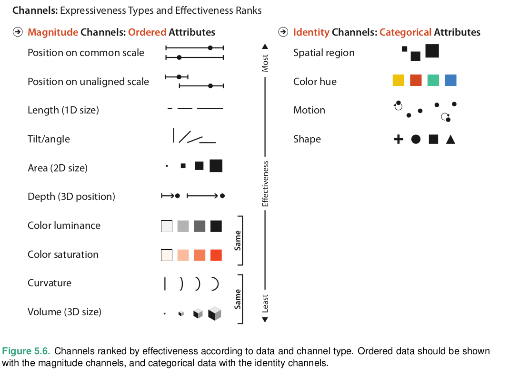
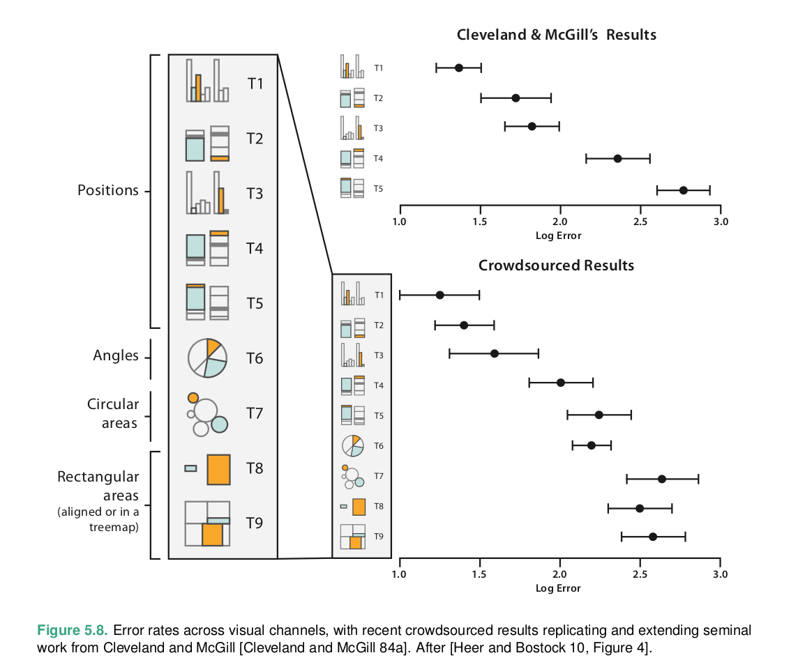
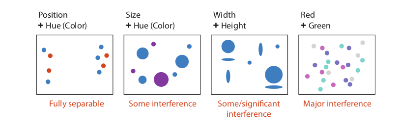
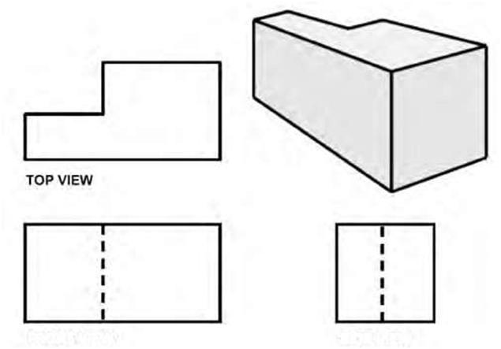
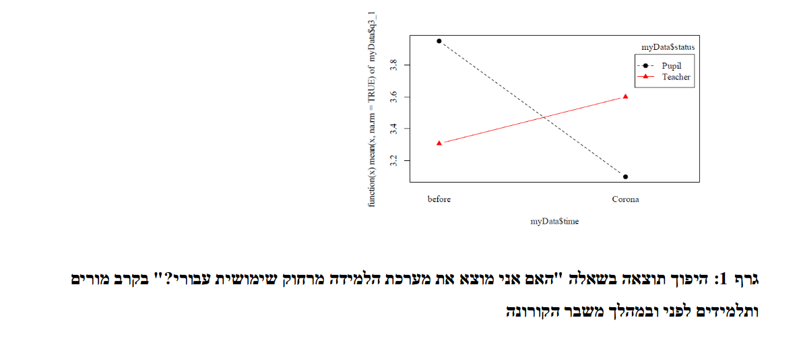

```{r echo=FALSE, warning=FALSE}
library(linguisticsdown)
library(ggplot2)
library(knitr)
library(dplyr)
library(ggstream)
library(data.table)
library(readxl)
library(gtools)
library(GGally)
source("sup/common.r")
```
---
### Marks and Channels
- graphical elements called *marks*
- visual *channels* to control their appearance
- some marks examples:
  0d point
  1d line
  2d area
  3d volume
- some channels examples:
  position
  color
  shape
  Tilt
  size
- Channel Types
  - identity (what-where)
  - magnitude (how much)
- Mark Type
  - table dataset
  - networks
    - nodes
    - links
        - connection
        - containment
---
### Expressiveness and Effectiveness
- The expressiveness principle dictates that the visual encoding should express all of, and only, the information in the data-set attributes
  - The identity channels are the correct match for the categorical attributes that have no intrinsic order.
  - The magnitude channels are the correct match for the ordered attributes, both ordinal and quantitative.
- The effectiveness principle dictates that the importance of the attribute should match the salience of the channel
---

---
### Accuracy

---
### Discriminability

matching the ranges: the number of different values that needs
to be shown for the attribute being encoded must not be greater
then the number of bins available for the visual channel used to
encode it

### Separability

---
### Grouping
- areas of containment
- lines of connection
- proximity
- similarity

---
### Rules of Thumb
- No unjustified 3D
  - The power of the plane
  - The Disparity of depth
  - Occlusion hides Information
  - Perspective distortion dangers
  - other depth cue
  - Tilted text isn't legibile
  - benefits of 3D: shape perception
  
---
- No Unjustified 2D
- Eyes beat memory
    - Memory and Attention
    - Animation vs. side by side views
    - change blindness
- Resolution over immersion
- Overview first, zoom and filter, details on demand (Ben Shneiderman)
- Responsiveness is required
- Get it right in B&W
- Function first, form next
---
### Arrange Tables
- arrange - use spatial channels for visual encoding
- Key, value, level
---
.scroll-output-100[
```{r warning=FALSE}
eduPic <- as.data.frame(read_excel("datasets/eduPic.xlsx",sheet = 1,col_names = TRUE))
e2<-as.data.frame(eduPic)
names(eduPic)
str<-"לא רלוונטי"
str2<-"לא מחושב"
eduPic[eduPic==str|eduPic==str2]<-NA
names(eduPic)[4]<-"eshcol"
names(eduPic)[5]<-"district"
names(eduPic)[9]<-"numSchools"
names(eduPic)[16]<-"a2ndDegreePercent"
names(eduPic)[18]<-"adjustmentsPercent"
names(eduPic)[35]<-"rateBagrut"
names(eduPic)[46]<-"a5pntMathPercent"
names(eduPic)[53]<-"classSizeHigh"

eduPic$a2ndDegreePerecnt<-as.numeric(eduPic$a2ndDegreePercent)
eduPic$a5pntMathPercent<-as.numeric(eduPic$a5pntMathPercent)
eduPic$adjustmentsPercent<-as.numeric(eduPic$adjustmentsPercent)
eduPic$rateBagrut<-as.numeric(eduPic$rateBagrut)
eduPic$classSizeHigh<-as.numeric(eduPic$classSizeHigh)

a<-eduPic %>%
  group_by(eshcol) %>%
  summarise(adjRate=mean(adjustmentsPercent,na.rm=T))
b<-eduPic %>%
  group_by(district) %>%
  summarise(adjRate=mean(adjustmentsPercent,na.rm=T))
```
]
---
.scroll-output-100[
```{r warning=FALSE}
ggplot(eduPic, aes(x=a2ndDegreePercent ,y=a5pntMathPercent))+geom_point()
ggplot(eduPic, aes(x=a2ndDegreePercent ,y=a5pntMathPercent))+geom_point()+geom_smooth(method=lm)
```
]
---
### Scatterplots
- Encodes two quantitative value variables using both the vertical and horizontal spatial position channels
- Effective for: 
    - providing overviews and characterizing distributions
    - finding outliers and extreme values
    - judging the correlation between two attributes.
    - augmented with color coding to show an additional attribute
    - bubble plot - size coded scatterplots
    
idiom | scatterplots
------|-------------
What:Data| Table: 2 quantitative value attributes
How: Encode|Express values with horizontal and vertical spatial position and point marks.
Why: Task | Find trends, outliers, distribution, correlation; locate clusters.
Scale| items: hundreds
---
### Separate, Order, and Align: Categorical Regions
- Spatial position is an ordered magnitude visual channel, but categorical attributes have unordered identity semantics. The principle of expressiveness will be violated if they are encoded with spatial position
- spatial region
---
### List Alignment: One Key
- Aligned list of items stretches across one of the spatial dimensions, and the region in which the values are shown stretches across the other
---
```{r }
ggplot(eduPic,aes(x=district,y=numSchools))+geom_bar(stat="sum")
```
---
idiom | Bar Charts
------|-------------
Waht:Data| Table: one quantitative value attribute, one categorical key attribute.
How:Encode|Line marks, express value attribute with aligned vertical position, separate key attribute with horizontal position.
Why: Task | Lookup and compare values.
Scale| Key attribute: dozens to hundreds of levels.
---
### stacked bar chart
- a more complex glyph for each bar
- The length of the composite glyph still encodes a value, as in a standard bar chart, but each subcomponent also encodes a length-encoded value.
- show information about multidimensional tables, specifically a two-dimensional table with two keys.
- use color as well as length coding
- easy to compare the first and last bar
---
```{r }
ggplot(eduPic,aes(x=district,y=numSchools,fill=factor(eshcol,levels=c("10","9","8","7","6","5","4","3","2","1"))))+geom_bar(stat="sum")
```

---
idiom | Stacked Bar Charts
------|-------------
Waht:Data| Multidimensional table: one quantitative value attribute, two categorical key attributes.
How:Encode|Bar glyph with length-coded subcomponents of a value attribute for each category of secondary key attribute. Separate bars by category of primary key attribute.
Why: Task | Part-to-whole relationship, lookup values, find trends.
Scale| Key attribute (main axis): dozens to hundreds of levels. Key attribute (stacked glyph axis): several to one dozen
---

.scroll-output-100[
```{r}
corona_cities <- read.csv("datasets/corona_city_table_ver_00147.csv",header = TRUE)
corona_cities_subset<-corona_cities[corona_cities$City_Code==c(6900,6500,1200,7000,3797),] 
corona_cities_subset$Cumulative_verified_cases[corona_cities_subset$Cumulative_verified_cases=="<15"]<-7
corona_cities_subset$Cumulative_verified_cases<-as.numeric(corona_cities_subset$Cumulative_verified_cases)
corona_cities_subset$Cumulated_deaths[corona_cities_subset$Cumulated_deaths=="<15"]<-7
corona_cities_subset$Cumulated_deaths<-as.numeric(corona_cities_subset$Cumulated_death)
corona_cities_subset$Date<-as.Date(corona_cities_subset$Date,foramt="%Y-%d-%m")
new_c<-corona_cities_subset %>%
  group_by(City_Name) %>%
  arrange(Date) %>%
  mutate(new_cases = Cumulative_verified_cases - lag(Cumulative_verified_cases, default = first(Cumulative_verified_cases)), new_deaths=Cumulated_deaths - lag(Cumulated_deaths, default = first(Cumulated_deaths)))

ggplot(new_c, aes(x = Date, y =new_deaths , fill = City_Name)) + geom_stream(type="ridge")
ggplot(new_c, aes(x = Date, y =new_cases , fill = City_Name)) + geom_stream(type="ridge")

ggplot(new_c, aes(x=new_cases, y=new_deaths,color=City_Name)) + geom_point()+geom_smooth(method=lm,se=F,fullrange=T)
```
]
---
### Streamgraph
idiom | Streamgraphs
------|-------------
What:Data| Multidimensional table:one quantitative value attribute, one ordered key attribute, one categorical key attribute.
What:Derived|One quantitative attribute (for layer ordering).
How:Encode|Use derived geometry showing categorial key layers across order key attribute, layer height encodes quantitative value attribute.
Scale|Key attributes (time, main axis): hundreds of time points. Key attributes (artists, short axis): dozens to hundreds
---
.scroll-output-100[
```{r}
ggplot(a,aes(x=eshcol,y=adjRate,group=1))+geom_point() +scale_x_discrete(limits = c("1","2","3","4","5","6","7","8","9","10"))
ggplot(a,aes(x=eshcol,y=adjRate,group=1))+geom_point() +geom_line()+scale_x_discrete(limits = c("1","2","3","4","5","6","7","8","9","10"))
ggplot(b,aes(x=district,y=adjRate,group=1))+geom_point() 
ggplot(b,aes(x=district,y=adjRate,group=1))+geom_point() +geom_line()
```
]
---
### Dot charts & Line charts
idiom | Dot Charts
------|-------------
What:Data| Table: one quantitative value attribute, one ordered key attribute
How:Encode|Express value attribute with aligned vertical position and point marks. Separate/order into horizontal regions by key attribute.

-

idiom | Line Charts
------|-------------
What:Data| Table: one quantitative value attribute, one ordered key attribute.
How:Encode|Dot chart with connection marks between dots.
why|show trends
Scale|key attribute: hundreds of levels
---

---
.scroll-output[
```{r}
ggplot(eduPic,aes(x=eshcol,y=district,fill=rateBagrut))+geom_tile()+scale_x_discrete(limits = c("1","2","3","4","5","6","7","8","9","10"))
```
---
### Matrix Alignment: Two Keys
idiom | Heatmaps
------|-------------
What:Data| Table: two categorical key attributes, one quantitative value attribute.
How:Encode|2D matrix alignment of area marks, diverging colormap.
why: Task|Find clusters, outliers; summarize.
Scale|Items: one million. Categorical attribute levels: hundreds. Quantitative attribute levels: 3–11.

-

idiom | Cluster Heatmaps
------|-------------
What:Derived| Two cluster hierarchies for table rows and columns.
How:Encode|Heatmap: 2D matrix alignment, ordered by both cluster hierarchies. Dendrogram: connection line marks for parent–child relationships in tree.
why|Find clusters, outliers; summarize.
Scale|Items: one million. Categorical attribute levels: hundreds. Quantitative attribute levels: 3–11.
---
.scroll-output-100[
```{r}
pairs(eduPic[,c(9,16,18,35,46,53)] )
pairs(eduPic[,c(9,16,18,35,46,53)] ,upper.panel = panel.cor)
```
]
---
### Scatterplot Matrix (SPLOM)
idiom | Scatterplot Matrix (SPLOM)
------|-------------
What:Data| Table.
What:Derived|Ordered key attribute: list of original attributes.
How:Encode|Scatterplots in 2D matrix alignment.
why:Task|Find correlation, trends, outliers.
Scale|Attributes: one dozen. Items: dozens to hundreds.

#### Multiple keys
 - Recursive subdivision
 - volumetric Grid (not recommended)
---
### Spatial Axis Orientation
- Rectilinear layout
- Parallel layout 
  - for more than 2 data attributes
  - solve channel inseparability
  - challenges:
    - order of axes
    - training time
- Radial layout
  - angle channel less accurately perceived than a rectilinear spatial position channel
  - angle channel is inherently cyclic, because the start and end point are the same, as opposed to the inherently linear nature of a position channel (nonmonotonic)
  - Radial layouts may be more effective than rectilinear ones in showing the periodicity of patterns (expressiveness)
  - Radial layouts imply an asymmetry of importance between the two attributes
---
.scroll-output-100[
```{r}
ggparcoord(data = eduPic,  columns = c(35,46,16,18,53))
ggparcoord(data = eduPic[eduPic$district=="דרום",],  columns = c(35,46,16,18,53))
```
]
---
idiom | Parallel Coordinates
------|-------------
What:Data|Table: many value attributes.
How:Encode|Parallel layout: horizontal spatial position used to separate axes, vertical spatial position used to express value along each aligned axis with connection line marks as segments between them.
why:Tasks|Find trends, outliers, extremes, correlation.
Scale|Attributes: dozens along secondary axis. Items: hundreds.
---
.scroll-output-100[
```{r}
ggplot(eduPic,aes(x=district,y=numSchools))+geom_bar(stat="sum")+ylim(-800,1200)

ggplot(eduPic,aes(x=district,y=numSchools))+geom_bar(stat="sum")+ylim(-800,1200)+ coord_polar(start = 0)
```
]
---
idiom |Radial Bar Charts
------|-------------
What:Data|Table: one quantitative attribute, one categorical attribute.
How:Encode|Length coding of line marks; radial layout.
---
#### pie charts
- Pie charts encode a single attribute with area marks and the angle channel
- Angle judgement on area marks are less accurate than length judgement on line marks. 
- The wedges vary in width along the radial axis, from narrow near the center to wide near the outside, making the area judgement particularly difficult.
- part of a whole
---
```{r}
ggplot(eduPic, aes(x="", y=numSchools, fill=district)) +  geom_bar(stat="sum", width=1) +  coord_polar("y", start=0)+theme_void()
```

---
idiom | Pie Charts
------|-------------
What:Data|Table: one quantitative attribute, one categorical attribute.
How:Encode|Area marks (wedges) with angle channel; radial layout.
why:Tasks|Part–whole relationship.
Scale|One dozen categories.
---
```{r }
ggplot(eduPic,aes(x=district,y=numSchools))+geom_bar(stat="sum")+ coord_polar(start = 0)
```
---
idiom | Polar Area Charts
------|-------------
What:Data|Table: one quantitative attribute, one categorical attribute.
How:Encode|Area marks (wedges) with length channel; radial layout.
why:Tasks|Part–whole relationship.
Scale|One dozen categories.

-

idiom | Normalized Stacked Bar Charts
------|-------------
What:Data|Multidimensional table: one quantitative value attribute, two categorical key attributes.
What: Derived|One quantitative value attribute (normalized version of original attribute).
How:Encode|Line marks with length channel; rectilinear layout.
why:Tasks|Part–whole relationship.
Scale|One dozen categories for stacked attribute. Several dozen categories for axis attribute.
---

