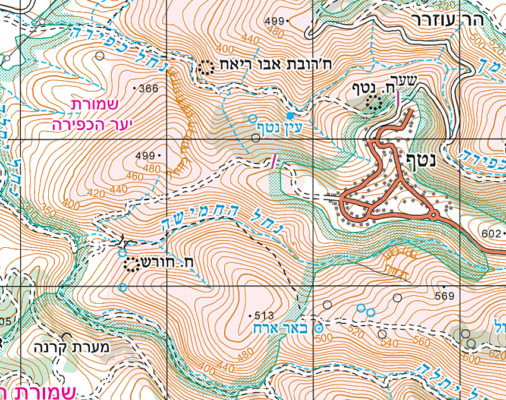

```{r echo=FALSE, warning=FALSE}
library(linguisticsdown)
library(ggplot2)
library(knitr)
library(dplyr)
library(ggstream)
library(data.table)
library(readxl)
library(gtools)
library(GGally)
source("sup/common.r")
```
---
### Arrange Spatial Data
- spatial semantics
- arrange is to use the given spatial to guide layout
- the position channel is not available for encoding other attributes
- if the given spatial position is the attribute of primary importance (effectiveness)
---
### Choropleth
- quatitative attribute encoded as color over regions delimited as area marks, where the shape of each region is determined by using given geometry
  - how to construct a colormap
  - what region boundaries to use
  
idiom | Choropleth Map
------|-------------
What:Data| Geographic geometry data. Table with one quantitative attribute per region
How:Encode|Space: use given geometry for area mark boundaries. Color: sequential segmented colormap
---

---
### Other Derived Geometry
- Scalar Field one value
  - slicing
  - isocontours
  - direct volume rendering

---
### Isocontours
- A set of isolines, namely, lines that represent the contours of a particular level of the scalar value
- occur far apart in regions of slow change and close together in regions of fast change
- never overlap

idiom | Topographic Terrain Map
------|-------------
What:Data| 2D spatial field; geographic data.
What: Derived| geometry: set of isolines computed from field.
How:Encode|Use given geographic data geometry of points, lines and region mark. use derived geometry as line mark.
why: Tasks| Query shape
Scale| Dozens of contour levels
---

---
### isofaces

- transforms a 3D scalar spatial field into one or more derived 2D surfaces.
- usually with intercative 3D navigation
- outer contour surfaces would occlude all the inner ones
- slider to control
- transparency


---

---


idiom | Flexible Isosurfaces
------|-------------
What:Data| Spatial field.
What: Derived| geometry: surfaces. Tree: simplified contour tree
How:Encode|Surfaces: use given. Tree: line mark, vertical spatial position encodes isovalues
why: Tasks| Query shape
Scale| one Dozen contour levels
---
### Direct Volume Rendering
- creates an image directly from
the information contained within the scalar spatial field, without deriving an intermediate geometric representation of a surface
- complex algorithms - how to carry it out efficiently and correctly
- transfer function that maps changes in the scalar value to opacity and color
---

---
idiom | Multidimensional Transfer Functions
------|-------------
What:Data| 3D spatial field.
What: Derived| 3D spatial field: gradient of original field.
What: Derived|Table: two key attributes, values binned from min to max for both data and derived data. One derived quantitative value attribute (item count per bin).
How:Encode|3D view: use given spatial field data, color and opacity from multidimensional transfer function. Joint histogram view: area marks in 2D matrix alignment,grayscale sequential colormap.
---
### Vector Fields: Multiple Values
- Cases:
    - 2D spatial flow
    - 3D spatial flow
    - flow on a 2D surface embedded within 3D space
- steady flows vs. unsteady flows
- critical points

---
### Flow Glyphs
- local information about a cell in the field using an object with internal substructure
- arrow: encode magnitude with length. direction with arrow orientation

---
### Geometric Flow
- The geometric flow idioms compute derived geometric data from the original field using trajectories computed from a sparse set of seed points and then directly show the derived geometry
- how to compute the trajectories
- The trajectory that a specific particle will follow is called a **streamline** for a steady field and a **pathline** for an unsteady (time-varying) field. A **streakline** traces all the particles that pass through a specific point in space.A **timeline** is formed by connecting a front of pathlines over
time

https://ieeexplore-ieee-org.ezproxy.bgu.ac.il/stamp/stamp.jsp?tp=&arnumber=1372179
---
### Texture Flow
- rely on particle tracing, but with dense coverage across the entire field rather than from a carefully selected set of seed points.

### Feature Flow
- The feature flow vis idioms rely on global computations across the entire vector field to explicitly locate all instances of specific structures of interest, such as critical points, vortices, and shock
---
### Tensor Fields: Many Values
- All of the idiom families used for vector fields are also used for tensor fields
- Ellipsoid Tensor Glyphs


---
