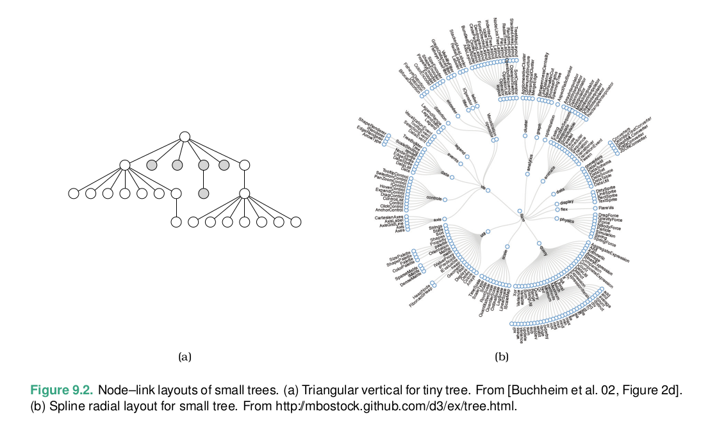
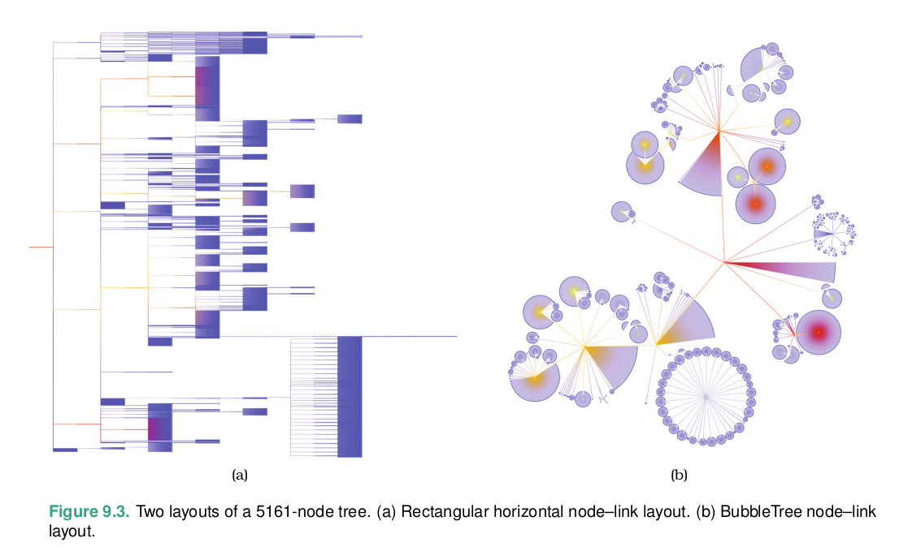
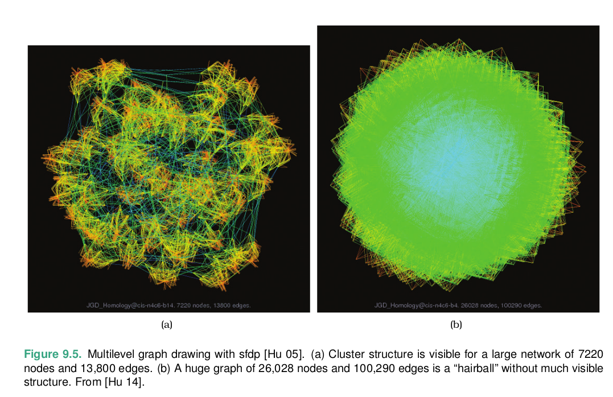
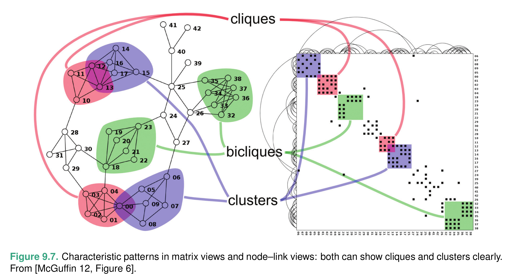
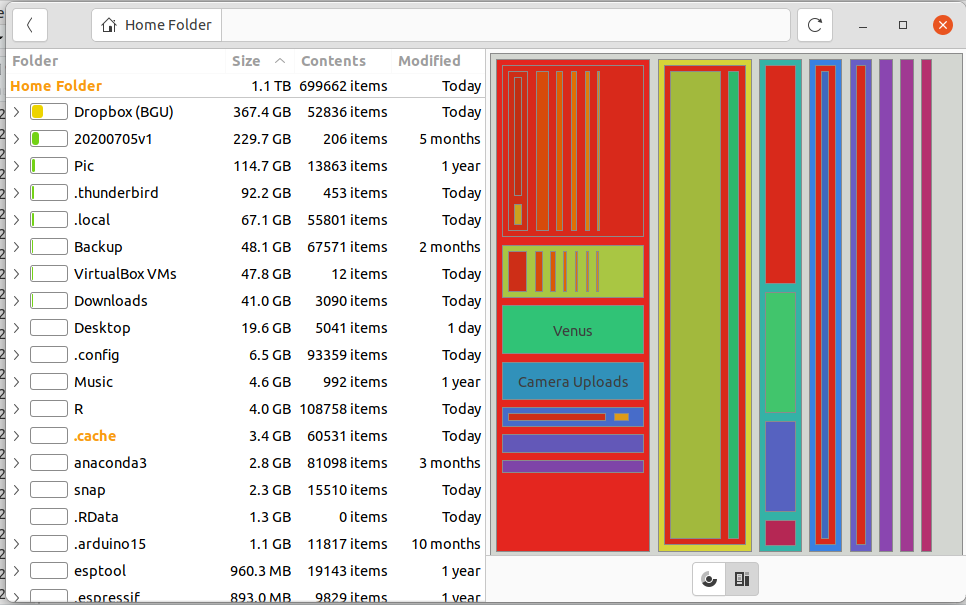
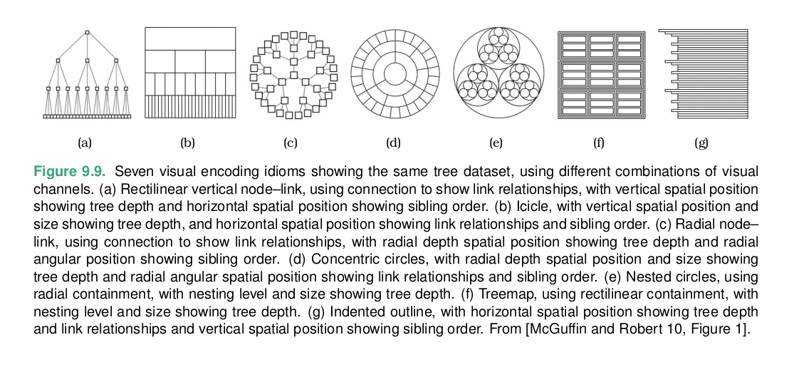

```{r echo=FALSE, warning=FALSE}
library(linguisticsdown)
library(ggplot2)
library(knitr)
library(dplyr)
library(ggstream)
library(data.table)
library(readxl)
library(gtools)
library(GGally)
library(treemapify)
source("sup/common.r")
```
---
### Connection: Line Marks
- Nodes are drawn as point marks and the links connecting them are drawn as line marks
- Triangular vertical node-link layout
    - root on top
    - leaves on the bottom
    - depth in the tree -> vertical spatial
- Spline radial layout
    - depth in the tree -> distance from the center

---

---
.scroll-output-100[
```{r}
library(network)
library(igraph)
library(ggraph)
library(graphlayouts)
data(flo)
iflo=graph_from_adjacency_matrix(flo, mode = "undirected")
autograph(iflo)
palette <- c("#1A5878", "#C44237", "#AD8941", "#E99093", 
                 "#50594B", "#8968CD", "#9ACD32")

# compute a clustering for node colors
V(iflo)$clu <- as.character(membership(cluster_louvain(iflo)))

# compute degree as node size
V(iflo)$size <- degree(iflo)
ggraph(iflo,layout = "stress")+
  geom_edge_link0(edge_colour = "grey66")+
  geom_node_point(aes(fill = clu,size = size),shape = 21)+
  geom_node_text(aes(filter = size >= 26, label = name),family="serif")+
  scale_fill_manual(values = palette)+
  scale_size(range = c(1,6))+
  theme_graph()+
  theme(legend.position = "none")


```
]
---
### Force Directed Placemnet
- many variants
- positioned according to a simulation of physical forces where nodes push away from each other while links act like springs that draw their endpoint nodes closer to each other
```{r}
help(layout_)
```
- usualy start with random placemnet
- Force-directed network layout idioms typically do not directly use spatial position to encode attribute values.
- nondeterministic method

idiom | Force-Directed Placement
------|-------------
What:Data| Netwrok
How:Encode|Point marks for nodes, connection marks for links.
Why:Tasks|Explore topology, locate paths
Scale|Nodes: dosen-hundreds. Links: hunderds. Node/link density L< 4N
---
- minimize line crossings,
- maintain a pleasing aspect ratio,
- minimize the total area of the drawing,
- minimize the total length of the edges,
- minimize the number of bends in the edges,
- minimize the number of distinct angles or curvatures used,
- strive for a symmetric structure.
- maximize angles between edges
---
.scroll-output-100[
```{r}
library(igraph)
library(intergraph)
a<-network::read.paj(file = "datasets/GiladFaceBook.net")

aIgraph<-asIgraph(a)
aIgraph<-as.undirected(aIgraph, mode = "collapse")

l <- layout_with_kk(aIgraph)
plot(aIgraph,vertex.size=2,vertex.label=NA, rescale=F,layout = l*0.4)


col<-rep("red",gsize(aIgraph))
col[largest_cliques(aIgraph)[[1]]]<-"green"
col[206]
plot(aIgraph,vertex.size=2,vertex.label=NA, vertex.color=col,rescale=F,layout = l*0.2)

census <- sna::clique.census(a, mode = "graph")

col<-rep("red",gsize(aIgraph))
col[which(coreness(aIgraph)==13)]<-"green"
plot(aIgraph,vertex.size=2,vertex.label=NA, vertex.color=col,rescale=F,layout = l*0.2)

eb<-edge.betweenness.community (aIgraph)
modularity(aIgraph,eb$membership)

col<-rep("red",gsize(aIgraph))
col[which(eb$membership==1)]<-"green"
plot(aIgraph,vertex.size=2,vertex.label=NA, vertex.color=col,rescale=F,layout = l*0.2)
```
]
---
### Scalable force directed placement (sfdp)
- convert large network to simple one. place the simple network. add the rest of the network

---
idiom |Multilevel Force-Directed Placement (sfdp)
------|-------------
What:Data| Network
What:Derived|Cluster hierarchy atop original network.
How:Encode|Point marks for nodes, connection marks for links.
Why:Tasks|Explore topology, locate paths and clusters
Scale|Nodes: 1000–10,000. Links: 1000–10,000. Node/link density: L < 4N.
---
### Matrix View
- adjacency matrix
.scroll-output-100[
```{r warning=FALSE}
# V(aIgraph)$comm <- membership(optimal.community(aIgraph))
V(aIgraph)$comm <- membership(edge.betweenness.community(aIgraph))
V(aIgraph)$degree <- degree(aIgraph)
V(aIgraph)$closeness <- centralization.closeness(aIgraph)$res
V(aIgraph)$betweenness <- centralization.betweenness(aIgraph)$res
V(aIgraph)$eigen <- centralization.evcent(aIgraph)$vector
V(aIgraph)$id<-1:209
node_list <- get.data.frame(aIgraph, what = "vertices")
edge_list <- get.data.frame(aIgraph, what = "edges") %>%
  inner_join(node_list %>% select(id, comm), by = c("from" = "id")) %>%
  inner_join(node_list %>% select(id, comm), by = c("to" = "id")) %>%
  mutate(group = ifelse(comm.x == comm.y, comm.x, NA) %>% factor())
all_nodes <- sort(node_list$id)
plot_data <- edge_list %>% mutate(
        to = factor(to, levels = all_nodes),
        from = factor(from, levels = all_nodes))
```
]
---
.scroll-output-100[
```{r}
ggplot(plot_data, aes(y = from, x = to, fill = group)) +
      geom_raster() +
      theme_bw() +
      scale_x_discrete(drop = FALSE) +
      scale_y_discrete(drop = FALSE) +
      theme(
        axis.text.x = element_text(angle = 270, hjust = 0),
        aspect.ratio = 1,
        legend.position = "none")
name_order <- (node_list %>% arrange(comm))$id
plot_data <- edge_list %>% mutate(
        to = factor(to, levels = name_order),
        from = factor(from, levels = name_order))
ggplot(plot_data, aes(y = from, x = to, fill = group)) +
      geom_raster() +
      theme_bw() +
      scale_x_discrete(drop = FALSE) +
      scale_y_discrete(drop = FALSE) +
      theme(
        axis.text.x = element_text(angle = 270, hjust = 0),
        aspect.ratio = 1,
        legend.position = "none")
```
]
---
idiom |Adjacency Matrix View
------|-------------
What:Data| Network
What:Derived|Table: network nodes as keys, link status between two nodes as values.
How:Encode|Area marks in 2D matrix alignment.
Scale|Nodes: 1000. Links: one milllion.

- Node link diagram is by far the most popular way to visualize networks
- for sufficiently small networks they are extremely intuitive for supporting many of the abstract tasks that pertain to network data.
- Their weakness is that past a certain limit of network size and link density, they become impossible to read
- matrix views is perceptual scalabale for both large and dense networks.
- the matrix view is predictible, stable, support reordering
- support search
- unfamilier
- findig specific type of nodes structure
- MV lack of support for investigating topological structure
---

---
### Containment: Hierarchy Marks
Treemaps
- heirarchical relationships are shown with containment rather than connection
- all the children of a tree node are enclosed within the area allocated that node

.scroll-output[
```{r}
p <- ggplot(G20, aes(area = 1, label = country, subgroup = hemisphere,
                     subgroup2 = region, subgroup3 = econ_classification)) +
  geom_treemap()+
  geom_treemap_subgroup3_border(colour = "blue", size = 1) +
  geom_treemap_subgroup2_border(colour = "white", size = 3) +
  geom_treemap_subgroup_border(colour = "red", size = 5) +
  geom_treemap_subgroup_text(place = "middle",colour = "red",alpha = 0.5,grow = T) +
  geom_treemap_subgroup2_text(colour = "white",alpha = 0.5,fontface = "italic") +
  geom_treemap_subgroup3_text(place = "top", colour = "blue", alpha = 0.5) +
  geom_treemap_text(colour = "white", place = "middle", reflow = T)
p
```
]
---

idiom |Treemaps
------|-------------
What:Data| Tree.
How:Encode|Area marks and containment, with rectilinear layout.
Why:Tasks|Query attributes at leaf nodes
Scale|Leaf nodes: one million. Links: one million.
---

---
[2021](http://mozart.diei.unipg.it/gdcontest/contest2021/index.php?id=results)
[2020](http://mozart.diei.unipg.it/gdcontest/contest2020/results.html)
[2019](http://mozart.diei.unipg.it/gdcontest/contest2019/results.html)