```{r echo=FALSE, warning=FALSE}
library(linguisticsdown)
library(ggplot2)
library(knitr)
library(dplyr)
library(readxl)
library(colortools)
```
---
### Eight Visual Variables
- primitives, marks
- primitives by themselves do not defne information displays but their spatial arrangement
- position, shape, size, brightness, color, orientation, texture, motion
---
### Position
- has the greatest impact on display of information
- The first step in "reading" a visualzation
- better to maximize the spread of representation
- avoid overlaps
- FAQ
    - where do most of the data fall?
    - Are there visible trends?
    - proximity, symmetry
    - are there clusters and structures?
- scale applied to variables to remap values to revel structure
    - linear scale
    - logarithmic scale
    - projection from space to space (usualy of lower dimensionality)
    
- Axes - graphical elemnts the provide additional information for undersanding how the visual space is defined
    - tick-marks indicating intervals
    - text labels provide data values
    - title contains the name of the data variable
    
---
### Shape
- mark: points, line, areas, volumes and their compositions
- does not include differences in sizes, shades, orientation
- consider the differentinablity between marks
- in a given visualization must have similar area and complexity

---
```{r warning=FALSE}
grid <- expand.grid(1:5, 6:1)
plot(grid, pch = 0:26, cex = 2.5,
     yaxt = "n", xaxt = "n",
     ann = FALSE, xlim = c(0.5, 5.25),
     ylim = c(0.5, 6.5))
```
---
### Size
 - Can be maped to interval and continuous data variable
 - Not recomanded for categorical data
 - with irregular shapes size become qualitative measure
 
### Brightness
- luminance
- distinguishablity limited by perception 
- recomanded to use perceptually linear brightness scale
---
```{r echo=T}
barplot(rep(1,56), col = hcl(300,60,25:100),space = 0,border = NA)
```

---
### Color Theory
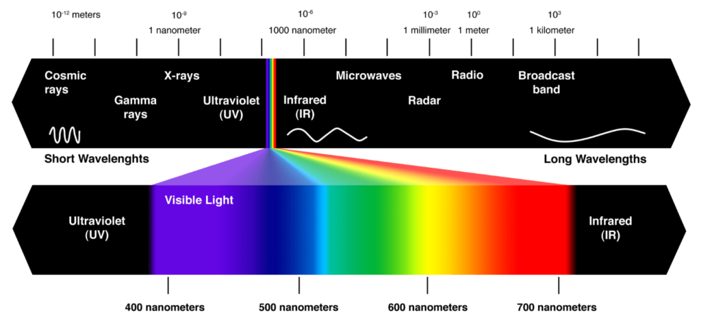
---
### Color Wheel
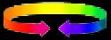
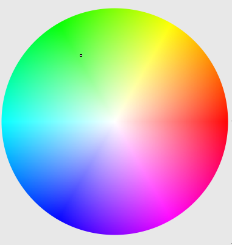
---
### RGB Vs. CMYK
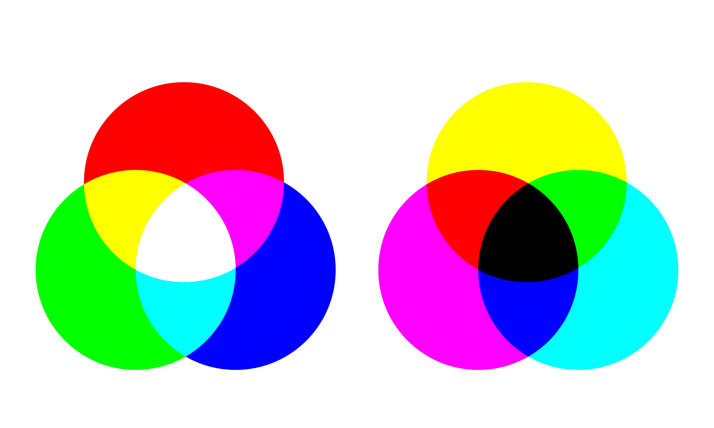
---
### 
- Additive Theory
  - White (sunlight) radiates ALL light
  - Black radiates no light
  - Light-emitting media use the process of capturing and radiating light, therefore they use Additive (Light) Theory
  - Primary colors in Additive Theory: Red	( R ) Green 	( G ) Blue	( B )
  - All the primaries mixed together to make WHITE
  - Additive (Light) Theory is used in computer monitors, television, theater lighting, and video production.
- Subtractive Theory
  - Black absorbs most light
  - White reflects most light
  - Colored Pigments absorb light and reflect only the frequency of the pigment color. 
  - All colors other than the pigment colors are absorbed, so this is called subtractive color theory.
  - Primary colors in Subtractive Theory: Cyan	( C ) Magenta	( M ) Yellow	( Y ) Black	( K )
  - Subtractive or Pigment Theory is used in desktop and commercial printing.
---
### Painter’s Color Wheel (RYB)

---
### Color
- RGB vs. HSV
- Hue represent the dominant wavelength [The technical name for color]
- Saturation is the level of hue relative to gray (purity) [brightness or dullness]
- Value  lightness or darkness
- Mapping data value to color
- interval and categorial values
- https://colorbrewer2.org/
- https://color.adobe.com/
- https://paletton.com/

.img-half[
.pull-left[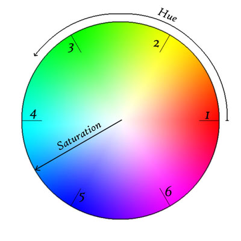].pull-right[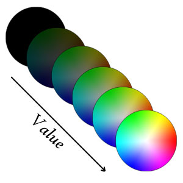]
]

---
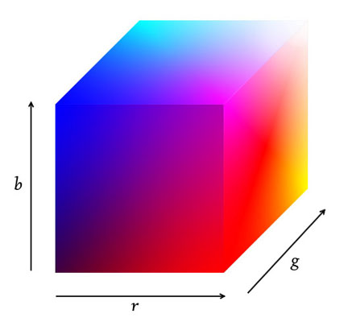
---
.scroll-output-100[
```{r fig.width=5, fig.height=4}

myDF<-read.csv("datasets/dogstype.csv", fileEncoding = "iso-8859-8")
ggplot()+geom_point(data=myDF,aes(x=גודל.יחסי,y=פופולאריות,color=קלות.אילוף),position="jitter")
```
]
---
### Hue, Tint, Shade, Tone
.scroll-output[
```{r}
r<-255
g<-0
b<-0
a<-0.5
c1=rgb(r,g,b,maxColorValue = 255)
c1
wheel(c1,num=12,verbose=FALSE,cex = 0.01 )
```
  - bold, cheerful, exciting
  
- Tint [Hue + White]
```{r}
c2=rgb(r+(255-r)*a,g+(255-g)*a,b+(255-b)*a,maxColorValue = 255)
wheel(c2,num=12,verbose=FALSE,cex=0.01)
```
  - soft, youthful, soothing
  
- shade [Hue + Black]
```{r}
c3=rgb(r+(0-r)*a,g+(0-g)*a,b+(0-b)*a,maxColorValue = 255)
wheel(c3,num=12,verbose=FALSE,cex=0.01)
```
  - deep, powerfull, mysterious
  
- tone [Hue + Gray]
```{r}
c4=rgb(r+(128-r)*a,g+(128-g)*a,b+(128-b)*a,maxColorValue = 255)
wheel(c4,num=12,verbose=FALSE,cex=0.01)
```
  - pleasing to the eye, complex, subtle, sophisticated
]
---
- Monochromatic uses different values of the same hue, including tints and shades
- Analogous: A selection of colors that are adjacent on the color wheel.
  - provide harmonious blends
- Complementary: Colors that are opposite on the wheel.  High Contrast
  - The more a color contrasts with the colors around it, the more easily visible that color will appear.
- Triadic: 3 colors equally spaced
---
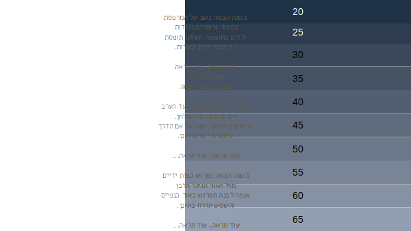
https://hclwizard.org/
---
### Background
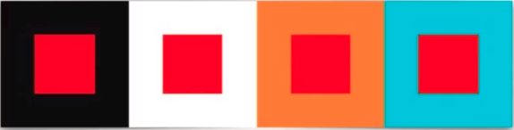
---

---

---

---
### Tips
- When small symbols, text, or other detailed graphical representations of information are displayed using color on a differently colored background,
always ensure luminance contrast with the background
- moving targets and stereoscopic depth influenced by luminance contrast
- If large areas are defined using nearly equiluminous colors, consider using thin border lines with large luminance differences (from the colors of the areas) to help define the shapes.

---
### Colors are relative
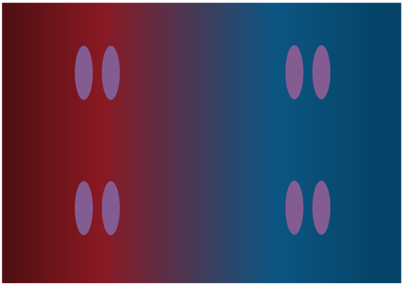
---
- If using color chroma to encode numerical quantity, use greater chroma to represent greater numerical quantities. 
- Avoid using a chroma sequence to encode more than four values.
- Colors for labling (Nominal Codes)
    - Sufficient Distinctness
    - We are far more sensitive to differences between large patches of color than small
patches of color.large areas - the colors should be of low chroma (saturation) and differ
only slightly from one another. Small marks strong,highly saturated colors.
    - Luminance Contrast with Background
    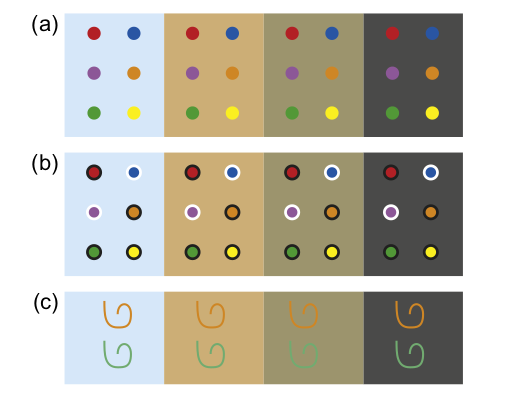
---
- Consider using nameable colors such as red, green, yellow, blue, brown, pink purple, and gray for color coded symbols. they are more remamberable
- Color Semantics (red=danger, green=go, healthy)
- Color Blindness
    - To create a set of symbol colors that can be distinguished by most color-blind individuals, ensure variation in the yellow-blue direction.
- Do not use more than 10 colors for coding symbols if reliable identification is required, especially if the symbols are to be used against a variety of
backgrounds.
---
### Color Highlight
- When highlighting text by changing the color of the font, it is important to maintain luminance contrast with the background. With a white background, high-saturation dark colors should be used to change the font color.
- When highlighting text by changing the background color, low-saturation light colors should be used if the text is black on white. The exception is yellow, because it is can be both light and have high saturation
---
### Pseudocolor Sequences
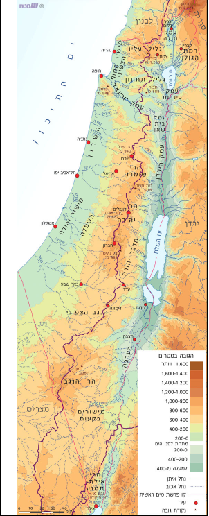
---
### Tasks in colormaps
1. Resolve features - our ability to perceive that a feature is present
2. Identify patterns - e.g. identifying highs and lows, telling positive from negative features
3. Reading values from a key
4. Classifying regions
---
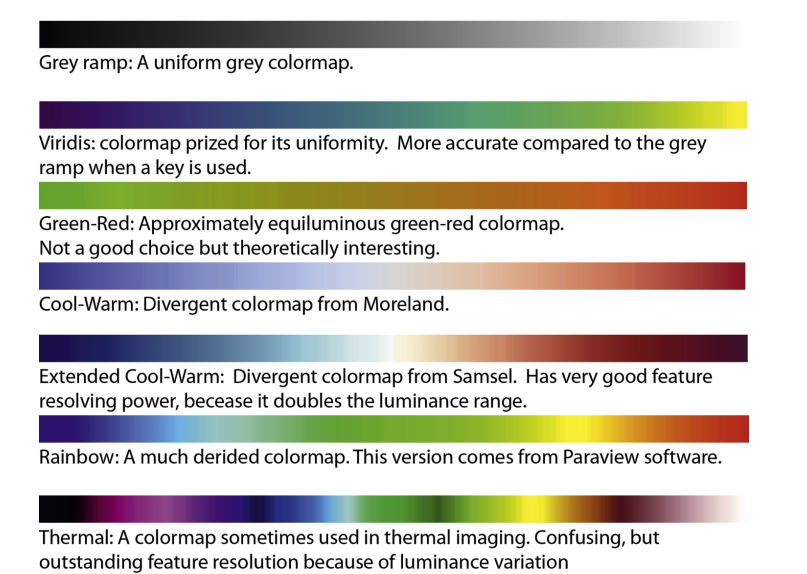
---
- The most important ordering is in terms of luminance
- rainbow sequence “hinders this task [of effectively conveying information] by confusing, obscuring and actively misleading.”
- using a uniform color space in which equal perceptual steps correspond to equal metric steps (Robertson & O’Callaghan, 1988)
- No known visualization technique is capable of accurately conveying ratios with any precision.
- To represent zero values construct a double ended colormap, with a neutral color, such as white or black in the middle. (diverging sequences,bipolar sequences)
- red-green sequence was most effective (Spence and Efendov (2001))
- Bivariate Color Sequences

---
### Color Wheel
.scroll-output[
```{r}

color<-"red"
wheel(color,num=18)
#picked<-wheel(color,num=18)[16]
picked<-"#FF66FFFF"
analogous(picked)
complementary(picked)
splitComp(picked)
tetradic(picked)
square(picked)
triadic(picked)
sequential(picked)

pals()
```
]
---
# XXX
```{r}
library("colorspace") 
#my_pal <- choose_palette()
#my_pal(3)
```
---
### Orientation
- How a mark is rotated in connection with data variable
- cannot be used with all marks
```{r fig.width=5, fig.height=4}

myDF<-read.csv("datasets/dogstype.csv", fileEncoding = "iso-8859-8")

ggplot()+geom_text(data=myDF,aes(x=פופולאריות,y=נשירה,angle=(18*קלות.אילוף),label="\U2191")) #U2191; U25CA
```
---
```{r fig.width=5, fig.height=4,warning=FALSE}

my_data <- read_excel("datasets/2018.xlsx",sheet=2,range = "a4:KB260")
my_data<- my_data[-1,]
my_data[,12]<-as.numeric(unlist(my_data[,12]))
my_data[,22]<-as.numeric(unlist(my_data[,22]))
```
---
```{r fig.width=5, fig.height=4,warning=FALSE}
names(my_data)[12]<-"percent_0_4"
names(my_data)[22]<-"people2sqkm"
ggplot()+geom_point(data=my_data,aes(x=people2sqkm , y=percent_0_4))
```
---
### Texture
- modest number of distinct types exist
### Motion
- associated woth other visual variables
- symbolize change
- not for print
---
### Jacques Bertin (1967)
Semiology of Graphics: Diagrams, Networks, Maps

- separation of content (the information to encode) from the container (the properties of the graohics system)
- A graphic is defined as a combination of plane properties (implantation plus imposition) and retinal variables (visual variabels above the plane)
- Graphics vocabulary
    - plane: homogeneous with two dimensions
    - marked by implantations
    - implantations: points, lines, areas
    - imposition: the arrengment of the implanatations
    - retinal variables: size, value (saturation), texture, color, orientation, shape

---
### Effect of Visual Variables
 
- Selective (immediately isolate a group of signs)
    - Size (length, area, volume)
    - Brightness
    - Texture
    - Color( hue)
    - Orientation
- Associative (grouping across changes in the variable)
    - Texture
    - Color
    - Orientation
    - Shape
---

### Effect of Visual Variables (2)
- Ordinal (immediately recognizable sequence)
    - Texture
    - Size
    - Brightness
- Proportional (estimation of the actual numerical difference between symbols)
    - Size
    - Orientation
    - Brightness
- Separating (all elements are visible)
    - Texture
    - Color
    - Orientation
    - Shape
---
### Effect of Visual Variables (3)
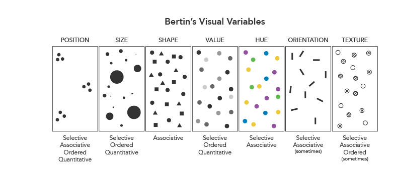

