.scroll-output[
```{r echo=FALSE, warning=FALSE}
library(linguisticsdown)
library(ggplot2)
library(knitr)
library(dplyr)
library(readxl)
library(httr)
library(tidyverse)
library(lubridate)
library(ggmap)
library(ggrepel)
library(gridExtra)
library(pander)
library(RCurl)
source("common.r")
```
]
---
### Lesson Goals

- Why to use visualization
- How visualization applied to problem solving
- The process of visualization
---
### Definitions
- Visualization is the communication of information using graphical representation
 
- visualization noun
vi··su··al··i··za··tion | \ ˌvi-zhə-wə-lə-ˈzā-shən  , ˌvi-zhə-lə-, ˌvizh-wə-lə- \
  1. formation of mental visual images

  2. the act or process of interpreting in visual terms or of putting into visible form

  3. the process of making an internal organ or part visible by the introduction (as by swallowing) of a radiopaque substance followed by radiography
  
- Computer-based visualization systems provide visual representations of datasets designed to help people carry out tasks more effectively.

(https://www.merriam-webster.com/dictionary/visualization)
---
### A Picture is Worth a Thousand Words
.right[]

- Wealth of information
- Quickly processed
  - Parallel processing with human perceptual system
- (can be) Independent of local language or culture 
---

### Vis. is Anywhere
```{r, echo=FALSE, cache=TRUE,out.width=200}
include_graphics2("images/1_2.png")
include_graphics2("images/1_3.png")
include_graphics2("images/1_4.png")
include_graphics2("images/1_6.jpeg")
```
---
###  Vis. is Anywhere (2)
```{r, echo=FALSE, cache=TRUE,out.width=200}
include_graphics2("images/1_5.png")
include_graphics2("images/1_7.png")
include_graphics2("images/1_8.png")
include_graphics2("images/1_9.jpg")
include_graphics2("images/1_10.png")
```
---
###  Vis. is Anywhere (3)
```{r, echo=FALSE, out.height="450px", cache=TRUE}
include_graphics2("images/1_11.jpeg")
```
---
### Tufte Definition
 Graphical excellence is the well-designed presentation of interesting data—a matter of substance, of statistics, and of design. ... [It] consists of complex ideas communicated with clarity, precision, and efficiency. ... [It] is that which gives to the viewer the greatest number of ideas in the shortest time with the least ink in the smallest space. ... [It] is nearly always multivariate. ... Graphical excellence requires telling the truth about the data. (Tufte 1983, 51)
---
### Open Questions
- Why visualizations have a richer description then textual form? 
- In what kinds of situations are visualizations effective?
- What types of information can and cannot be visualized?
- How many different ways are there to show the same data?
- Which ones are best for particular circumstances?
- Why should we study visualization?
---
### Same or Different?
`r columns(2, 1)`
.scroll-output[
```{r warning=FALSE, cache=TRUE}
mydf=read.csv("datasets/corona_deceased_ver_00138.csv",header=T)
mydf$Time_between_positive_and_death=as.numeric(mydf$Time_between_positive_and_death)
mydf$Time_between_positive_and_hospitalization=as.numeric(mydf$Time_between_positive_and_hospitalization)
mydf$Length_of_hospitalization=as.numeric(mydf$Length_of_hospitalization)
mydf$gender=as.factor(mydf$gender)
mydf$Age_group=as.factor(mydf$Age_group)

plot1<-ggplot(mydf,aes(x=Time_between_positive_and_hospitalization, y=Time_between_positive_and_death,color=gender)) +
  geom_point()
plot1+scale_x_continuous(limits=c(-500,10000),labels = NULL)+scale_y_continuous(limits=c(0,4000),labels = NULL)
plot1+scale_x_continuous(limits=c(-300,300),labels = NULL)+scale_y_continuous(limits=c(0,2000),labels = NULL)
plot1+scale_x_continuous(limits=c(-2000,2000),labels = NULL)+scale_y_continuous(limits=c(0,300),labels = NULL)
plot1+scale_x_continuous(limits=c(-300,300),labels = NULL)+scale_y_continuous(limits=c(0,300),labels = NULL)
plot1+scale_x_continuous(limits=c(-300,300),labels = NULL)+scale_y_continuous(limits=c(-100,300),labels = NULL,trans="log10")
```
]
---
### Same or Different? (2)
`r columns(2, 1)`
.scroll-output[
```{r warning=FALSE, cache=TRUE}
plot1<-ggplot(mydf,aes(x=Time_between_positive_and_hospitalization, y=Time_between_positive_and_death,color=gender)) +
  geom_point()
plot1+scale_x_continuous(limits=c(-500,10000))+scale_y_continuous(limits=c(0,4000))
plot1+scale_x_continuous(limits=c(-300,300))+scale_y_continuous(limits=c(0,2000))
plot1+scale_x_continuous(limits=c(-2000,2000))+scale_y_continuous(limits=c(0,300))
plot1+scale_x_continuous(limits=c(-300,300))+scale_y_continuous(limits=c(0,300))
plot1+scale_x_continuous(limits=c(-300,300))+scale_y_continuous(limits=c(-100,300),trans="log10")
```
]
---
### Influence of Data Display Format
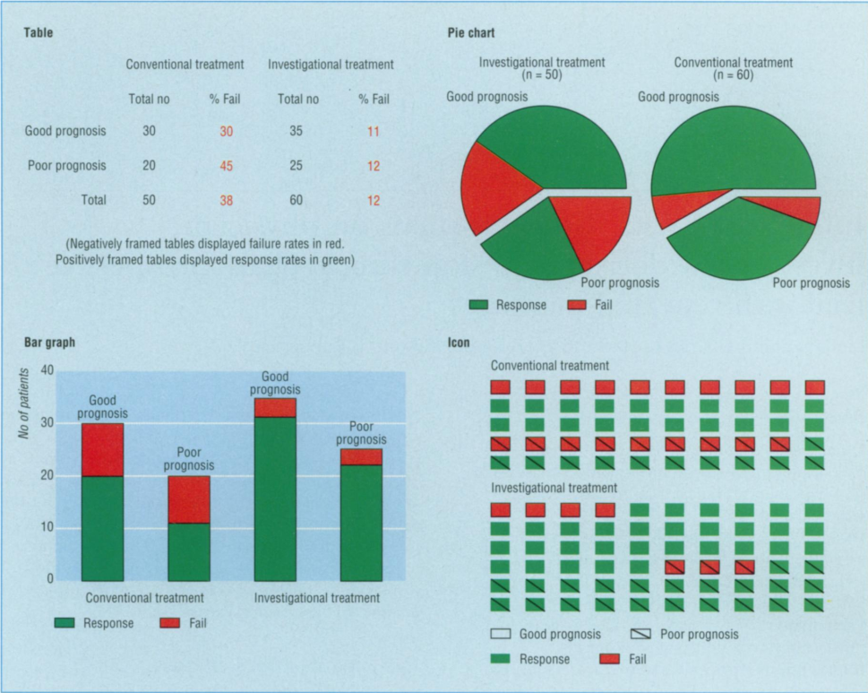

.small[
From: Elting, L. S., Martin, C. G., Cantor, S. B., Rubenstei, E. B. (1999) Influence of data display formats on physician investigators' decisions to stop clinical trials: prospective trial with repeated measures. BMJ, 318( 7197), 1527-1531
]

---
### Organizational Chart
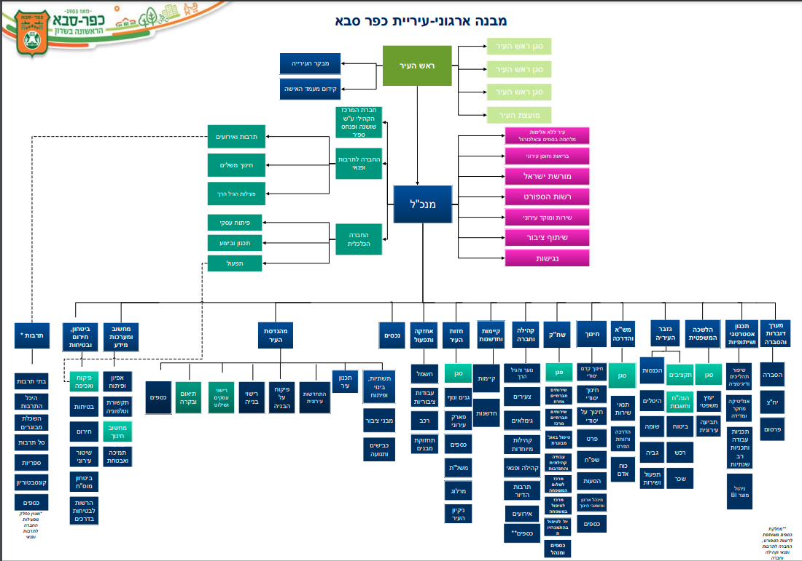

.small[
From: https://www.kfar-saba.muni.il/uploads/n/1628075616.3487.pdf
]
---
### History of Vis.
https://www.datavis.ca/milestones


.small[
Lascaux cave ~17,000 year ago
]
---
### Kish Table


.small[
Kish Table, 3200 BC
]
---
### Hieroglyphics


.small[
Hieroglyphs on the temple at ancient Ombos, near modern Kawm Umbu, Egypt.
]

- logograms
- phonograms
- determinatives
---
### Tabula Peutingeriana


.small[
Tabula Peutingeriana ~1300 AC
]
---
### Hereford Mappa Mundi

.small[
~1300 AC
]
---
### John Snow's Map


.small[
1854
]
---
### Valentine Seaman's Map of Yellow Fever Epidemic in New York City


.small[1798]
---
### Abu Rayhan Muhammad Ibn Ahmad al-Biruni


.small[Kitab al-Qanun al-Mas’udi ~1030]
---
### Somnium Scripionus (Cicero)


.small[~10-11 cnetrury AC]
---
### Charles Joseph Minard


"Probably the best statistical graphic ever drawn" (Edward Tufte)

.small[1869]
---
### William Playfair


.small[1786]
---
### Joseph Priestley


.small[1765]
---
### Florence Nightingale
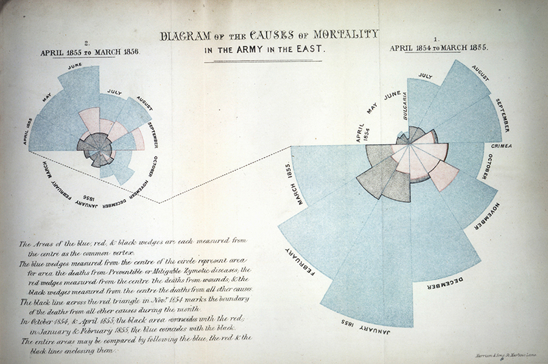
.small[1858]


---
### Leonardo da Vinci


.small[1510]
---
# Visualization Today

---
### Israel Railways


---
### NTA


---
### Google Maps
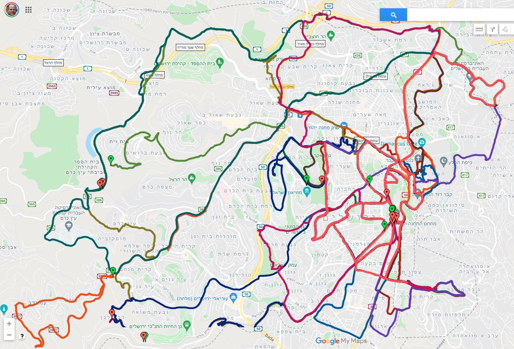

---
### TA-35 Index
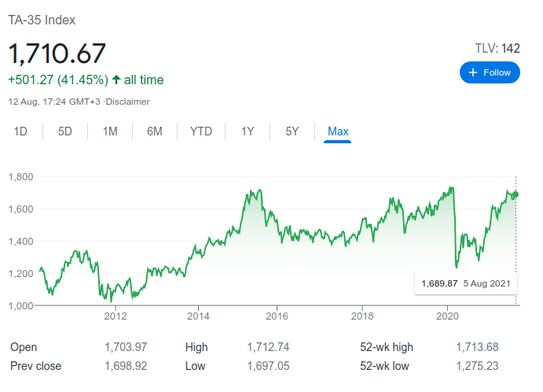

---
### ECG


---
### Scientific Research
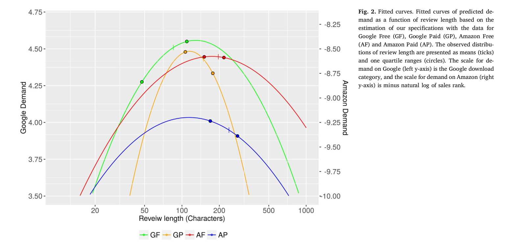

.small[Longer Online Reviews are not Necessarily Better (Fink et. al. 2018)]
---
### Outliners
- Jackman, R. M. (1980). The impact of outliers on income inequality. American Sociological Review, 45, 344–47.
- Hewitt, C. (1977). The effect of political democracy and social democracy on equality in industrial societies: A cross-national comparison. American Sociological Review, 42, 450–64.
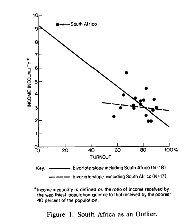

---
### Correlation vs. distribution
`r columns(1, 1)`
.scroll-output[
```{r , echo=FALSE, out.height="600px", cache=TRUE }
source("http://janhove.github.io/RCode/plot_r.R")
plot_r(r = 0.8, n = 50)
```
]
---
### What Makes Bad Figures Bad?
- Bad Taste
    - maximize data-ink ratio
    - memorable vs. interpretable
- Bad Data
- Bad Perception
    - Tufte's Lie factor
---
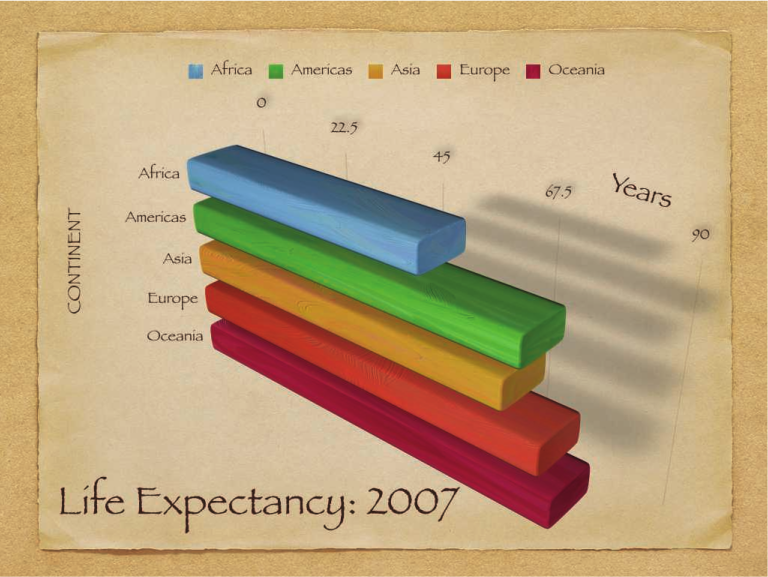

---
### Nigel Holmes 

---
- https://www.nytimes.com/2016/11/29/world/americas/western-liberal-democracy.html
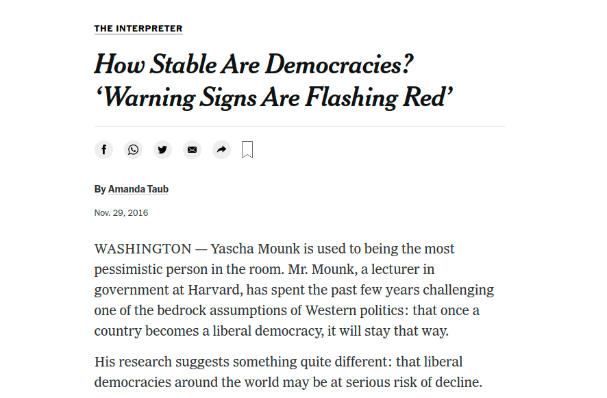
---
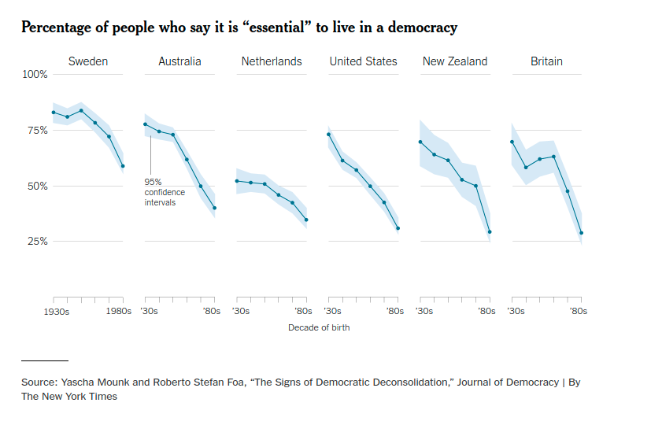
---
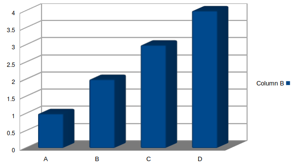
---
### Cardiovascular System

---

Vis. provides a visual representation of objects that may include

 - data
 - algorithms
 - results of computations
 - processes
 - user controls
 - numerous other components of an application.
---
### Simulation Vis.


---
### Process Vis.
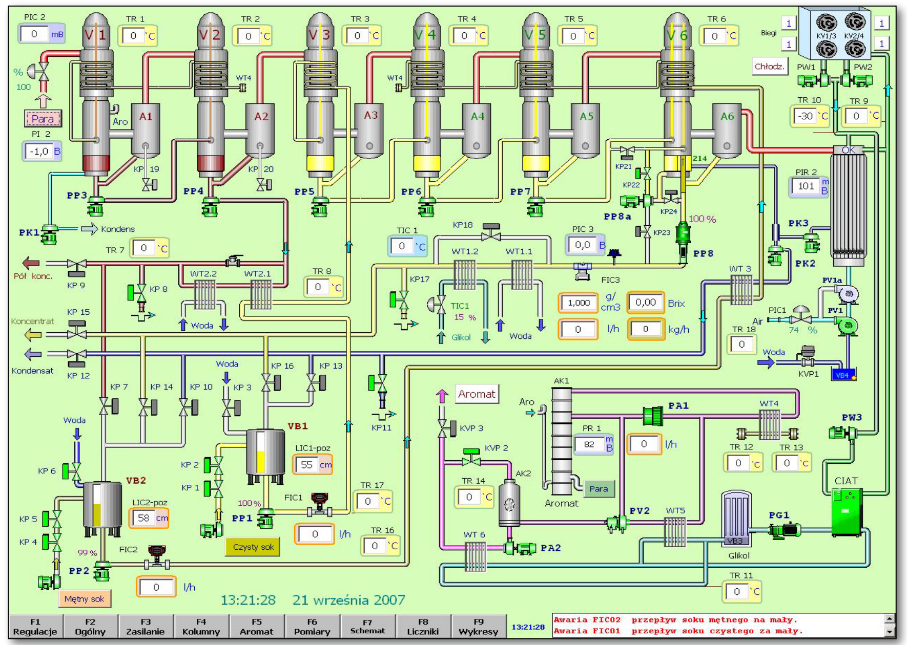

---
### Social Networks
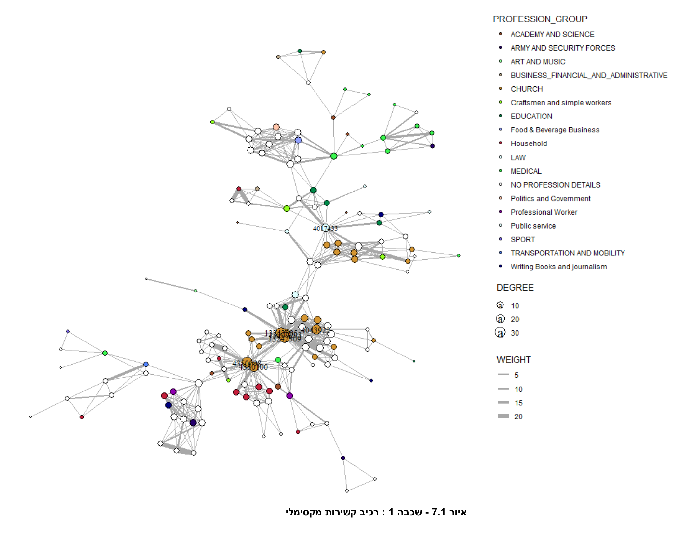

---
### Agriculture (NDVI)


---
### Vis. and Other Fields
 - Visualization vs. computer graphics
 - scientific visualization and information visualization
---
### Role of the User
 - user as designer
 - user as explorer
